# Informe: Visualización del cambio de contexto con GDB

Este informe documenta, con capturas paso a paso, el **cambio de contexto** en x86 dentro de `context_switch`, mostrando el **estado del stack al inicio**, **cómo evoluciona instrucción a instrucción** y **cómo quedan los registros luego del `iret`**.

## 1) Evidencia del cambio de contexto

La siguiente captura muestra el momento del cambio de contexto (tránsito por `context_switch` invocado desde `env_run`/`alltraps`), con `EIP` y `ESP` apuntando al nuevo contexto.

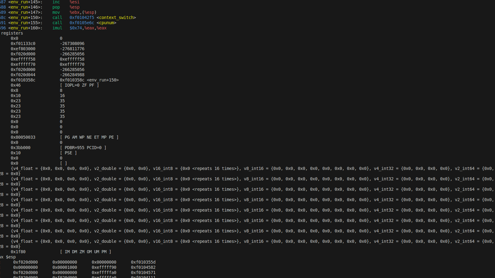

## 2) Stack al inicio de `context_switch`

Captura tomada **apenas ingresamos** a `context_switch` (antes de desempilar registros de segmento), mostrando el **dump del stack** y los punteros relevantes.

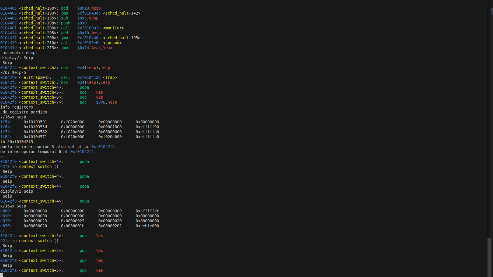

## 3) Evolución del stack instrucción a instrucción

- **Paso 1**: primeras instrucciones (`popa`, `pop %es`, `pop %ds`) y su efecto sobre `$esp`.

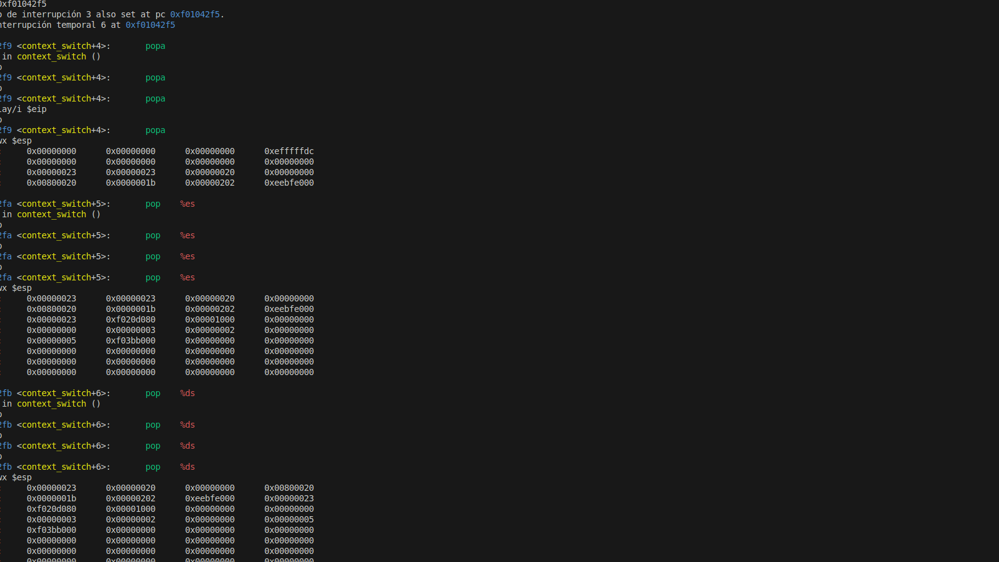

- **Paso 2**: actualización de `$esp` y preparación para `iret` (stack ya contiene `eip`,`cs`,`eflags` del retorno).

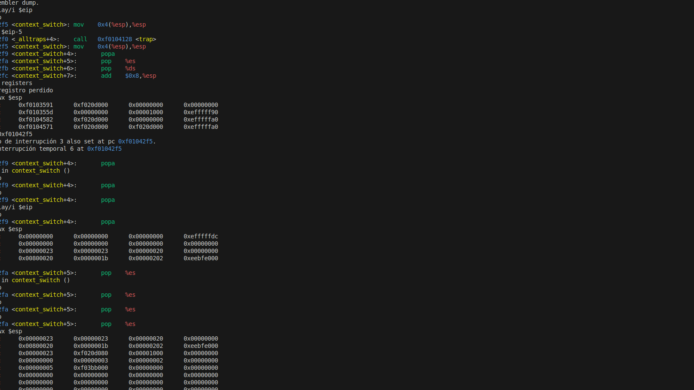

## 4) Antes del `iret`

En esta captura se observa el **estado final del stack justo antes de ejecutar `iret`**, listo para restaurar `EIP`, `CS` y `EFLAGS` del proceso que será retomado.

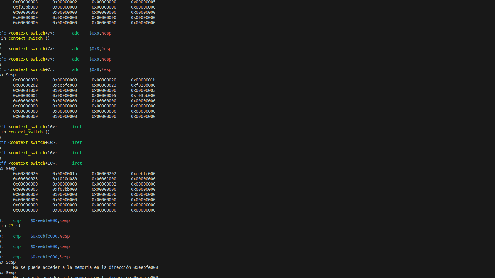

## 5) Registros luego de `iret`

Registros inmediatamente **después** de `iret`: se verifica que `EIP` apunta a la instrucción de usuario/siguiente trampolín y que los selectores (`CS`, `SS`) y `EFLAGS` fueron **restaurados** correctamente.

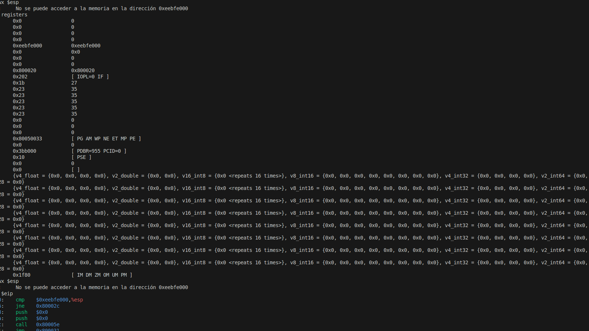

---

# Sección: `_alltraps` y validación de syscalls

A continuación se documenta la implementación y verificación de `_alltraps` en `kern/trapentry.S` y la validación de las **syscalls** con `GDB`.

## 1) Estado del stack al invocar `_alltraps`

- **Evidencia**: ruptura en `_alltraps` proveniente de **usuario**. Se observa `trapno=0x20` (IRQ0 timer) y `err=0x0`. Este punto confirma que `_alltraps` recibe 
**todas** las interrupciones/excepciones (no solo syscalls) y que el stack entra con el formato de retorno de `iret` + los valores empujados por las macros (`trapno`, `err`).
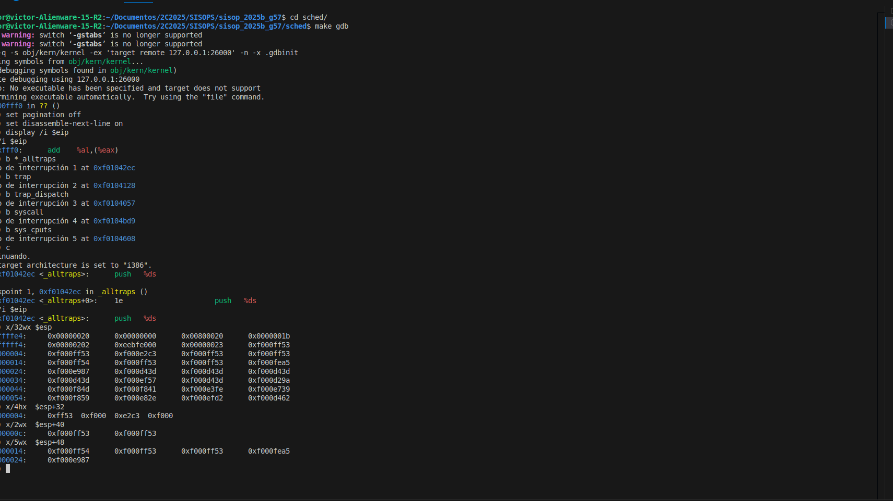

## 2) Construcción del `Trapframe` en `_alltraps`
- **Evidencia**: tras ejecutar `push %ds`, `push %es`, `pusha` se ve el **dump del stack** con los registros generales guardados y `ds/es` leyendo aún `0x23` (segmentos 
de usuario) **antes** de recargarlos a `GD_KD (0x10)`.

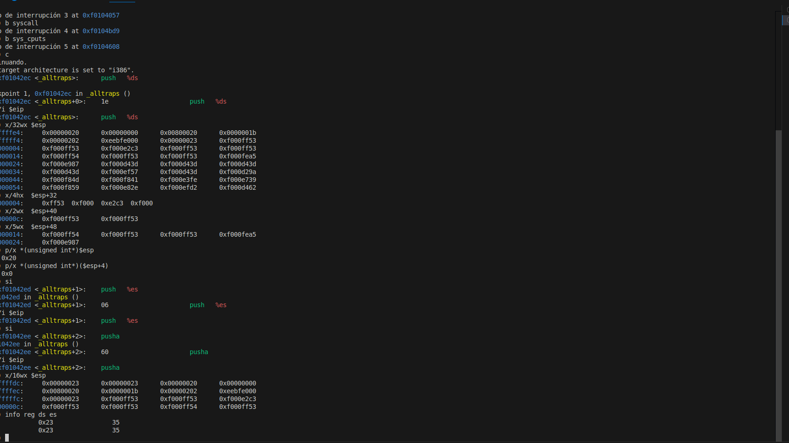

## 3) Llamada a `trap(tf)` y chequeo de `tf->trapno/err`

- **Evidencia**: ya en `trap()`, se inspecciona el argumento `tf` y se leen `tf->trapno=0x20` y `tf->err=0x0`, coincidente con lo observado al ingresar por `_alltraps`.

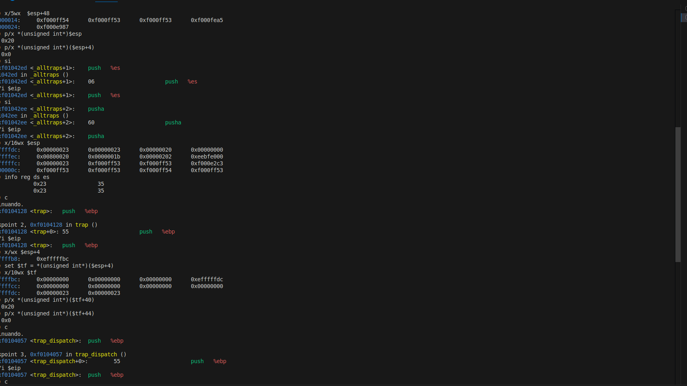

## 4) Desvío por `trap_dispatch` y validación de **syscalls**

- **Evidencia**: ruptura repetida en `trap_dispatch` mostrando interrupciones periódicas (timer). Para **validar syscalls**, se configuraron breakpoints en `syscall` y `sys_cputs` y un breakpoint condicional en `_alltraps` para `trapno==0x30`.

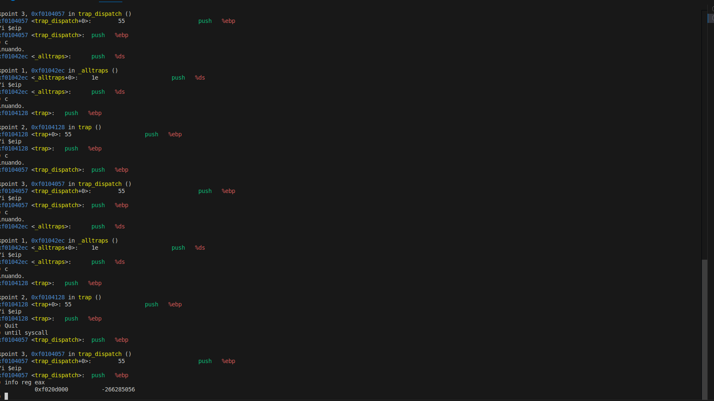

# Informe: Explicacion de implementación de Scheduler con prioridad
Se implementa la política de planificación basada en prioridades. La modificación permite que el **scheduler** seleccione los procesos listos para ejecutarse considerando su prioridad asignada. De esta forma, los procesos con mayor prioridad obtienen mayor acceso al CPU, mientras que los de menor prioridad deben esperar su turno.

## 1) Asignación de prioridad por proceso
- Se añadió el campo `int env_priority` en la estructura `Env`.
- La prioridad se asigna al momento de crear el proceso.

## 2) Syscalls para manejo de prioridades
Se implementarion las llamadas:
- `sys_env_get_priority(envid_t envid)` devuelve la prioridad de un proceso.
- `sys_env_set_priority(envid_t envid, int priority)` modifica la prioridad.

Son llamadas seguras, ya que solo permiten reducir la prioridad de un proceso. La implementación de la validación dentro de la syscall `sys_env_set_priority` impide a los procesos aumentar su prioridad. De esta manera, un proceso no puede ganar más CPU de la que el sistema le asignó originalmente, sin embargo si puede ceder prioridad voluntariamente. Esto permite evitar que procesos maliciosos o mal diseñados obtengan más tiempo de CPU.

## 3) Compatibilidad con syscalls existentes
- Procesos creados mediante `fork()`: Se decidió que el proceso hijo **herede** la prioridad del padre, de modo que se mantiene la consistencia con el resto de atributos de ejecución y evita que nuevos procesos alteren el balance del planificador. Esto garantiza estabilidad, previsibilidad y control sobre la asignación de CPU.

## 4) Procesos de prueba

**Procesos `priorityhigh.c`, `prioritymedium.c` y `prioritylow.c`:** Cada uno realiza iteraciones, imprime su progreso y utiliza `sys_yield()` para ceder la CPU voluntariamente.

Durante la ejecucion en QEMU:
- Los procesos con mayor prioridad fueron seleccionados primero y ejecutados más veces.
- Los procesos con prioridad intermedia y baja fueron planificados con menor frecuencia o después de los de mayor prioridad

    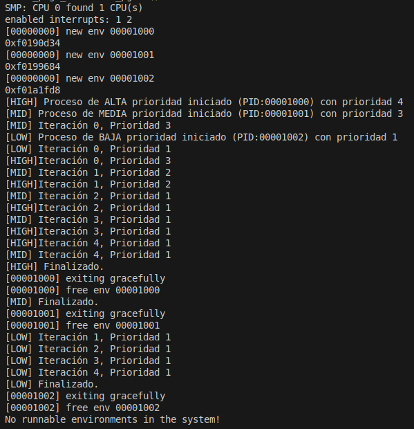
    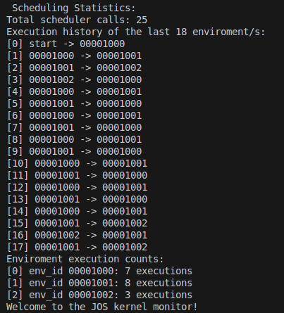

**Proceso `prioritychange.c`:** Ejecuta aumento y disminución de prioridad, muestra el estado antes y después de cada intento.

Durante la ejecucion en QEMU:      

- Se comprueba que al intentar aumentar la prioridad de un proceso, la operación es ignorada, mientras que al reducirla, el cambio se aplica correctamente.

    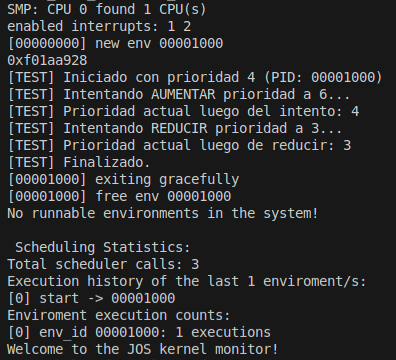

