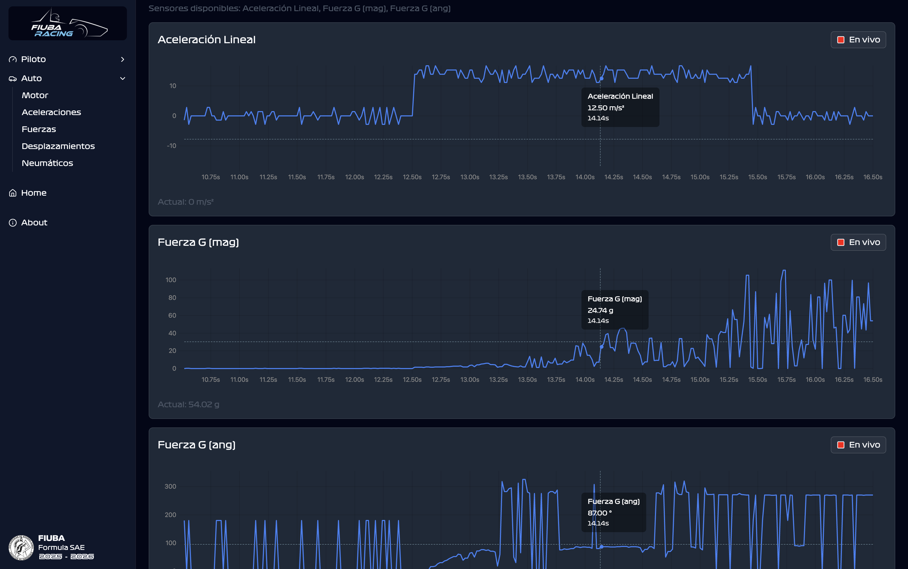

# FR-Telemetry
## *Esta carpeta esta desactualizada (Enero 2026) y no refleja el estado actual del proyecto*
**FR-Telemetry** is a cross-platform desktop application designed for the FIUBA Racing Team (Formula SAE). It serves as a dashboard to visualize, analyze, and monitor real-time telemetry data streaming from the racing vehicle, as well as importing compatible files with data.



## Key Features

### Real-Time Data Visualization
* **Live Streaming:** Captures and renders sensor data values immediately as they are received from the vehicle.
* **Dynamic Charting:** Utilizes responsive line charts to display trends over time for sensor metrics.
* **Visual Indicators:** Includes specialized visual components, such as a real-time Steering Wheel Rotation.

### Data File Upload
* Allows compatible *CSV* and *TXT* data files to be uploaded and reviewed, using the same charts as live telemetry

### Playback & Analysis Controls
* **Live vs. Static Modes:** Users can toggle the entire dashboard between "Live" mode (auto-scrolling with new data) and "Static" mode (paused for inspection).
* **Global & Individual Viewports:**
    * **Global Control:** A master slider allows users to scroll back through the history of all sensors simultaneously to correlate events.
    * **Individual Control:** Specific charts can be unlinked from the global viewport, allowing for analysis of a single sensor while others remain live.

### Categorized Navigation
* Sensors are automatically sorted into categories (e.g., *Motor*, *Aceleraciones*, *TPS & Freno etc.*) accessible via the sidebar.

### User Experience & Customization
* **Theme Support:** Built-in dark and light mode toggle.
* **Responsive Layout:** A collapsible sidebar and responsive grid system ensure the application scales well across different screen sizes.

## Tech Stack & Key Libraries

### Frontend (Electron & React)
* **[Electron](https://www.electronjs.org/):** Wraps the web application into a native desktop exe.
* **[React](https://react.dev/):** The library for building the user interface.
* **[uPlot](https://github.com/leeoniya/uPlot):** The primary charting library used to render the line charts for sensor data.
* **[Vite](https://vitejs.dev/):** The build tool and bundler.

### Backend (Python)
* **[Flask](https://flask.palletsprojects.com/):** A web application framework acting as the API server to bridge data between the Python backend and the React frontend.
* **[PySerial](https://pyserial.readthedocs.io/):** Handles the serial port communication to read data streams from the vehicle's telemetry hardware or simulation interface.

## Prerequisites

Before installing, ensure your computer has the following software installed:

* **Node.js** (v18 or higher recommended)
* **Python** (v3.8 or higher)
* **npm** (typically packaged with Node.js)

## Installation Guide

1.  **Clone the repository:**
    ```bash
    git clone [https://github.com/fiubaracing/FR-Telemetry.git](https://github.com/rojoloter/incom.git)
    cd FR-Telemetry
    ```

2.  **Install Backend Dependencies:**
    ```bash
    cd backend
    pip install -r requirements

3.  **Install Frontend Dependencies:**
    Navigate to the frontend folder and install the Node.js packages.
    ```bash
    cd ../fr-telemetry
    npm install
    ```

## How to Run

You can start the entire system (Backend API + Electron App) with a single command from the frontend directory.

1.  Navigate to the `fr-telemetry` directory:
    ```bash
    cd fr-telemetry
    ```

2.  Start the development environment:
    ```bash
    npm run dev
    ```
    *This command utilizes `concurrently` to launch the Flask API server and the Electron window simultaneously. You may want to run the backend 
or the frontend by its own. Use **npm run start:backend** for the backend, or **npm run dev:electron** for the frontend instead.*

## Configuration
Right now, all the live data is being simulated with a [dedicated simulator](https://github.com/LautiDO/Electro-FiubaRacing/tree/main/Simulador).
You can find an extensive spanish README to set up the simulator. Just make sure it is running in a different IDE window or terminal, 
and make sure that any changes made to the baud rate, and port names, are made to the api.py file of this repo as well.

## Future Features
The following features are planned:

* [ ] **UI Polish:** Refine the Home screen and overall interface.
* [ ] **Multi-File Comparison:** Enable uploading multiple files simultaneously to compare sensor data across different laps or sessions.
* [ ] **Graph Overlays:** Implement the ability to overlay multiple datasets on a single chart for direct performance comparison.
* [ ] **Context-Aware Visualization:** Add diverse chart types optimized for specific data categories (e.g., bar charts for tire temperatures vs. line charts for RPM).
* [ ] **Customizable Layouts:** Allow users to rearrange, resize, and hide/show charts, with the ability to save and load these custom dashboard presets.
* [ ] **Video Synchronization:** Integrate synchronized video playback (e.g., GoPro footage) alongside the telemetry data stream for visual correlation.
* [ ] **Data Export:** Provide functionality to export processed sensor data into standard formats (CSV, TXT) for external analysis.
* [ ] **Sensor Statistics:** Automatically calculate and display key metrics per sensor, such as average velocity, max RPM, or standard deviation.
* [ ] **Critical Alerts:** Implement a warning system to visually notify users when sensor values exceed defined safety thresholds (e.g., engine overheating).
* [ ] **Data Annotation:** Create a system for users to add comments or markers at specific timestamps to highlight events of interest.
* [ ] **Interactive Zoom:** Enhance charting capabilities with zoom controls for detailed inspection of specific data segments.
* [ ] **Tooltips for Icons:** Add new Tooltips to header icons to show additional information to the user about what each button does.
* [x] **New App Icon:** Add new FIUBA Racing Team window icon to the app, to upgrade from the default Electron icon.
* [x] **Home Screen Refactor:** Modify Home screen, moving components to separate files for better modularization. Show loading file message in all screens.
* [ ] **Repo Migration:** Move repo to FR organization.


## Project Structure

* **`/backend`**: Contains the Python Flask application and serial communication logic (`api.py`).
* **`/fr-telemetry`**: Contains the Electron/React source code.
    * **`/src/components`**: Reusable UI components (Charts, Sidebar, etc.).
    * **`/src/lib`**: Utility functions and sensor data class definitions.
## Contact
#### Santiago Rojo (srojo@fi.uba.ar) & Alejo Fábregas (afabregas@fi.uba.ar)
